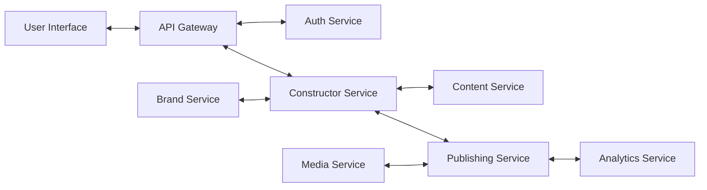

# Архитектура компонентов мульти-брендового конструктора сайтов

## Микросервисная архитектура

Система построена на основе микросервисной архитектуры, что обеспечивает гибкость, масштабируемость и отказоустойчивость. Каждый микросервис отвечает за определенную бизнес-функцию и может быть разработан, развернут и масштабирован независимо.

## Основные микросервисы

### 1. Сервис управления пользователями (User Service)

**Ответственность:**
- Регистрация и аутентификация пользователей
- Управление профилями пользователей
- Управление ролями и разрешениями

**Технологии:**
- NestJS
- JWT для аутентификации
- PostgreSQL для хранения данных пользователей

**API:**
- `/api/auth` - аутентификация и авторизация
- `/api/users` - управление пользователями
- `/api/roles` - управление ролями

### 2. Сервис управления брендами (Brand Service)

**Ответственность:**
- Создание и управление брендами
- Настройка параметров брендов
- Управление доступом к брендам

**Технологии:**
- NestJS
- PostgreSQL для хранения данных брендов
- Redis для кэширования

**API:**
- `/api/brands` - управление брендами
- `/api/brands/:id/settings` - настройки бренда
- `/api/brands/:id/users` - пользователи бренда

### 3. Сервис конструктора (Constructor Service)

**Ответственность:**
- Создание и редактирование сайтов
- Управление шаблонами
- Управление компонентами интерфейса

**Технологии:**
- NestJS
- PostgreSQL для хранения структуры сайтов
- Redis для кэширования

**API:**
- `/api/sites` - управление сайтами
- `/api/templates` - управление шаблонами
- `/api/components` - управление компонентами

### 4. Сервис управления контентом (Content Service)

**Ответственность:**
- Управление страницами
- Управление блоками контента
- Версионирование контента

**Технологии:**
- NestJS
- PostgreSQL для хранения контента
- Redis для кэширования

**API:**
- `/api/pages` - управление страницами
- `/api/blocks` - управление блоками контента
- `/api/versions` - управление версиями

### 5. Сервис медиа-файлов (Media Service)

**Ответственность:**
- Загрузка и хранение изображений
- Обработка и оптимизация изображений
- Управление медиа-библиотекой

**Технологии:**
- NestJS
- Object Storage (S3-compatible)
- PostgreSQL для метаданных
- Sharp для обработки изображений

**API:**
- `/api/media` - управление медиа-файлами
- `/api/media/upload` - загрузка файлов
- `/api/media/library` - медиа-библиотека

### 6. Сервис публикации (Publishing Service)

**Ответственность:**
- Публикация сайтов
- Генерация статических файлов
- Управление доменами и хостингом

**Технологии:**
- NestJS
- Redis для очередей задач
- CDN для доставки контента

**API:**
- `/api/publish` - публикация сайтов
- `/api/domains` - управление доменами
- `/api/hosting` - настройки хостинга

### 7. Сервис аналитики (Analytics Service)

**Ответственность:**
- Сбор данных о посещениях
- Генерация отчетов
- Анализ поведения пользователей

**Технологии:**
- NestJS
- PostgreSQL (для хранения аналитических данных)
- Redis для кэширования

**API:**
- `/api/analytics` - получение аналитики
- `/api/reports` - генерация отчетов
- `/api/events` - события пользователей

## Взаимодействие между сервисами

### Синхронное взаимодействие
- REST API для прямых запросов между сервисами
- GraphQL для агрегации данных из нескольких сервисов

### Асинхронное взаимодействие
- RabbitMQ для обмена сообщениями между сервисами

## Схема взаимодействия компонентов

## API Gateway

API Gateway служит единой точкой входа для всех клиентских запросов и обеспечивает:

- Маршрутизацию запросов к соответствующим микросервисам
- Аутентификацию и авторизацию
- Балансировку нагрузки
- Кэширование
- Мониторинг и логирование
- Ограничение скорости запросов (Rate Limiting)

## Обеспечение отказоустойчивости

- Circuit Breaker для предотвращения каскадных отказов
- Retry механизмы для повторных попыток при временных сбоях
- Fallback стратегии для деградации функциональности
- Health checks для мониторинга состояния сервисов
