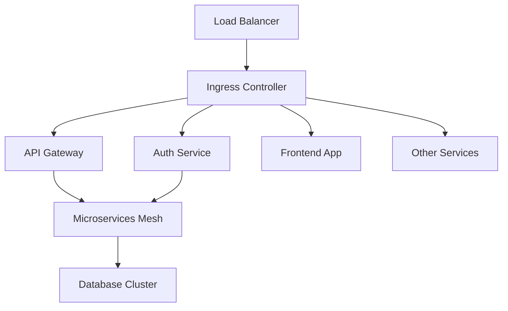

# Архитектура развертывания мульти-брендового конструктора сайтов

## Обзор

Данный документ описывает архитектуру развертывания распределенной системы мульти-брендового конструктора сайтов.

## Инфраструктура

### Среды развертывания

Система развертывается в следующих средах:

1. **Разработка (Development)** - среда для разработки и тестирования новых функций
2. **Тестирование (Staging)** - среда для интеграционного тестирования и предрелизной проверки
3. **Продакшн (Production)** - рабочая среда для конечных пользователей

### Облачная инфраструктура

Система развертывается в облачной инфраструктуре с использованием следующих компонентов:

- **Docker** - контейнеризация
- **K8S** - оркестрация
- **Облачный провайдер** - AWS/GCP/Azure
- **Terraform** - для управления инфраструктурой

## Архитектура Kubernetes

### Кластеры

Для обеспечения изоляции и управления ресурсами используются отдельные кластеры Kubernetes:

1. **Кластер разработки** - для среды разработки
2. **Кластер тестирования** - для среды тестирования
3. **Кластер продакшн** - для рабочей среды

Продакшн-кластер разворачивается в нескольких зонах доступности для обеспечения высокой доступности.

### Namespace

Внутри каждого кластера ресурсы организованы по namespace:

- **frontend** - для фронтенд-приложений
- **backend** - для бэкенд-сервисов
- **database** - для баз данных
- **monitoring** - для систем мониторинга
- **logging** - для систем логирования
- **ingress** - для входящего трафика
- **cert-manager** - для управления SSL-сертификатами

### Компоненты инфраструктуры

#### Ingress Controller

Для маршрутизации входящего трафика используется Nginx Ingress Controller, который обеспечивает:

- Балансировку нагрузки
- SSL-терминацию
- Маршрутизацию запросов к соответствующим сервисам
- Управление заголовками и куками

#### Service Mesh

Для управления коммуникацией между сервисами используется Istio Service Mesh, который обеспечивает:

- Маршрутизацию трафика
- Балансировку нагрузки
- Отказоустойчивость (Circuit Breaking)
- Мониторинг и трассировку
- Безопасность (mTLS)

#### Хранилище данных

- **PostgreSQL** - развертывается с использованием StatefulSet с репликацией
- **Redis** - для кэширования и очередей сообщений
- **Object Storage** - для хранения медиа-файлов (S3-compatible)

## Схема развертывания микросервисов

## Развертывание микросервисов

Каждый микросервис развертывается как отдельный Deployment в Kubernetes с следующими характеристиками:

- **Replicas** - несколько реплик для обеспечения высокой доступности
- **Resource Limits** - ограничения по CPU и памяти
- **Health Checks** - проверки работоспособности (liveness и readiness)
- **Autoscaling** - автоматическое масштабирование на основе нагрузки

## Стратегии развертывания

### Непрерывная интеграция и доставка (CI/CD)

Для автоматизации процесса сборки, тестирования и развертывания используется CI/CD пайплайн:

1. **Сборка** - сборка Docker-образов 
2. **Тестирование** - запуск автоматических тестов
3. **Сканирование** - проверка безопасности и качества кода
4. **Публикация** - публикация Docker-образов в реестр
5. **Развертывание** - обновление Kubernetes-ресурсов

## Мониторинг и логирование

### Мониторинг

Для мониторинга системы используются следующие инструменты:

- **Prometheus** - сбор метрик
- **Grafana** - визуализация метрик
- **Alertmanager** - оповещение о проблемах

### Логирование

Для централизованного сбора и анализа логов используется стек ELK (возможна замена на opensearch):

- **Elasticsearch** - хранение и индексация логов
- **Logstash** - обработка и фильтрация логов
- **Kibana** - визуализация и анализ логов
- **Filebeat** - сбор логов с контейнеров

### Трассировка

Для трассировки запросов используется Jaeger

## Безопасность

### Сетевая безопасность

- **Network Policies**
- **mTLS**
- **WAF**

### Управление секретами

- **Kubernetes Secrets**
- **Vault**

### Внешний доступ

- Load Balancer для входящего трафика
- Ingress Controller для маршрутизации запросов
- CDN для статического контента

## Резервное копирование и восстановление

### Резервное копирование

- Регулярное резервное копирование баз данных
- Резервное копирование конфигураций Kubernetes
- Резервное копирование медиа-файлов

### Восстановление после сбоев

- Автоматическое восстановление подов при сбоях
- Процедуры восстановления баз данных
- План аварийного восстановления

## Масштабирование

### Вертикальное масштабирование

- Увеличение ресурсов (CPU, память) для подов
- Вертикальное масштабирование баз данных

### Горизонтальное масштабирование

- Увеличение количества реплик микросервисов
- Шардирование баз данных
- Репликация баз данных
